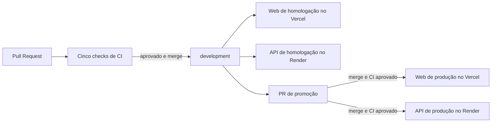

# CI/CD do Kapa

Este documento descreve o pipeline de integração contínua já ativo e o plano de entrega contínua do monorepo.

## Estado atual

- **CI:** ativo no GitHub Actions.
- **CD:** planejado, ainda sem acesso aos provedores e sem secrets de deploy configurados.
- **Ambientes previstos:** homologação a partir de `development` e produção a partir de `main`.

## Integração contínua

O workflow está em [`.github/workflows/quality.yml`](../.github/workflows/quality.yml).

### Gatilhos

| Evento | Execução |
| --- | --- |
| Pull Request | Executa o CI para qualquer branch de destino |
| Push em `development` | Executa o CI da homologação |
| Push em `main` | Executa o CI da produção |
| Push em outra branch | Não executa; a validação acontece quando houver Pull Request |
| Disparo manual | Disponível por `workflow_dispatch` |

Execuções do mesmo PR ou branch usam concorrência. Quando chega um commit mais novo, a execução anterior é cancelada.

### Checks apresentados no GitHub

| Check | Etapas internas |
| --- | --- |
| `CI / ESLint` | Instalação reproduzível com `npm ci`, ESLint, geração do Prisma Client e type-check |
| `CI / Testes` | Segredo JWT efêmero, testes automatizados, build da API e build web |
| `CI / Cobertura` | Testes com LCOV, artefato de cobertura e comentário no PR |
| `CI / Dockerfile (build base)` | Build completo da imagem de runtime da API |
| `CI / Segurança (Semgrep + Trivy + npm audit)` | Auditoria npm, Semgrep, Trivy e Gitleaks |

As ferramentas de segurança continuam executando mesmo quando uma etapa anterior encontra um problema, permitindo consultar todos os resultados da execução.

### Cobertura no Pull Request

Em PRs criados dentro do próprio repositório, o workflow publica um comentário novo a cada push com:

- commit analisado;
- link para a execução do GitHub Actions;
- cobertura de statements, branches, functions e lines;
- resultados agrupados em `mobile-web`, `server`, `shared` e total.

O relatório completo `coverage/lcov.info` permanece disponível como artefato por sete dias. PRs de forks executam a cobertura, mas não recebem permissão para publicar comentários.

### Proteção das branches

Configure regras para `development` e `main` exigindo os cinco checks listados acima. Para `development`, mantenha também aprovação de outro desenvolvedor, discussões resolvidas e Squash and merge, conforme o [`CONTRIBUTING.md`](../CONTRIBUTING.md).

### Dependabot

O arquivo [`.github/dependabot.yml`](../.github/dependabot.yml) procura atualizações npm e GitHub Actions semanalmente. Existe uma espera de sete dias depois da publicação de uma versão para reduzir o risco de adotar imediatamente uma versão comprometida ou instável.

## Entrega contínua planejada

### Provedores

- **Web:** Vercel, recebendo a exportação web do Expo gerada por `npm run build:web`.
- **API:** Render, construindo [`apps/server/Dockerfile`](../apps/server/Dockerfile) com o contexto na raiz do monorepo.
- **Mobile:** EAS Build/Submit em uma etapa posterior, quando o fluxo de publicação nas lojas estiver definido.

O Expo gera uma aplicação web estática que pode ser hospedada no Vercel. O Render permite configurar o deploy automático somente depois que os checks do GitHub passam.

### Ambientes

| Branch | Ambiente GitHub | Destino | Comportamento |
| --- | --- | --- | --- |
| `development` | `staging` | Vercel + Render de homologação | Deploy automático após o CI aprovado |
| `main` | `production` | Vercel + Render de produção | Deploy após o CI aprovado e aprovação do ambiente, quando disponível no plano do repositório |
| Branch de trabalho/PR | nenhum secret de produção | Preview web opcional | Nunca acessa credenciais de produção |

Homologação e produção devem usar bancos, Redis, buckets S3, chaves JWT e credenciais Google separados.

### Bloqueios antes de ativar o CD

1. Corrigir as vulnerabilidades existentes no `package-lock.json`; o check `Segurança` bloqueia o deploy enquanto estiver vermelho.
2. Alterar a API para aceitar uma variável `REDIS_URL`. Atualmente [`RedisService.ts`](../apps/server/src/services/RedisService.ts) usa `localhost`, que não funciona com Redis gerenciado.
3. Criar os projetos de homologação e produção no Vercel e no Render.
4. Definir PostgreSQL/Supabase, Redis e armazenamento S3 separados por ambiente.
5. Configurar os domínios e as origens CORS exatas.
6. Cadastrar secrets nos ambientes do GitHub e nos provedores, sem copiar arquivos `.env`.

### Variáveis da API por ambiente

| Grupo | Variáveis |
| --- | --- |
| Runtime | `NODE_ENV`, `PORT`, `CLIENT_URL` |
| PostgreSQL | `DATABASE_URL`, `DIRECT_URL` |
| Autenticação | `JWT_SECRET`, `JWT_ISSUER`, `JWT_AUDIENCE`, `ACCESS_TOKEN_TTL_SECONDS`, `SALT_SECRET` |
| Redis | futura `REDIS_URL` |
| S3 | `S3_ENDPOINT`, `S3_PUBLIC_URL`, `S3_REGION`, `S3_BUCKET`, `S3_ACCESS_KEY`, `S3_SECRET_KEY` |
| Google | `GOOGLE_CLIENT_ID`, `GOOGLE_WEB_CLIENT_ID`, `GOOGLE_IOS_CLIENT_ID`, `GOOGLE_ANDROID_CLIENT_ID` |

Variáveis `SEED_ADMIN_*` não devem permanecer no runtime de produção depois do uso controlado. O workflow de deploy não executará migrations nem seed automaticamente.

### Variáveis públicas do web

- `EXPO_PUBLIC_API_URL`, sempre HTTPS e terminando na API correta;
- `EXPO_PUBLIC_GOOGLE_WEB_CLIENT_ID`;
- `EXPO_PUBLIC_GOOGLE_ANDROID_CLIENT_ID`;
- `EXPO_PUBLIC_GOOGLE_IOS_CLIENT_ID`.

Variáveis com prefixo `EXPO_PUBLIC_` são incorporadas ao bundle e não podem conter segredos.

## Sequência de implementação do CD

1. Resolver a dívida de dependências até o check `Segurança` passar.
2. Implementar e testar `REDIS_URL` sem alterar o schema do banco.
3. Criar os serviços de homologação e validar API, CORS, banco, Redis e S3.
4. Configurar o Render com **After CI Checks Pass** para `development`.
5. Configurar o projeto web de homologação no Vercel.
6. Criar os ambientes `staging` e `production` no GitHub, restringindo branches e secrets.
7. Adicionar o workflow de deploy do web depois do CI aprovado.
8. Repetir a configuração para `main`, com aprovação de produção e estratégia de rollback.
9. Adicionar EAS Build/Submit quando a equipe definir contas e publicação Android/iOS.

## Rollback

- **Vercel:** promover novamente um deployment anterior validado.
- **Render:** fazer rollback para um deploy anterior ou redeploy de um commit conhecido.
- **Banco:** migrations exigem processo próprio, backup e aprovação humana; o CD não reverte schema automaticamente.

## Referências operacionais

- [Deploys e integração com checks no Render](https://render.com/docs/deploys)
- [Deploy hooks do Render](https://render.com/docs/deploy-hooks)
- [Vercel com GitHub Actions](https://vercel.com/docs/git/vercel-for-github)
- [Ambientes e proteção de deploy no GitHub](https://docs.github.com/en/actions/reference/workflows-and-actions/deployments-and-environments)
- [Exportação web estática com Expo Router](https://docs.expo.dev/router/web/static-rendering/)
